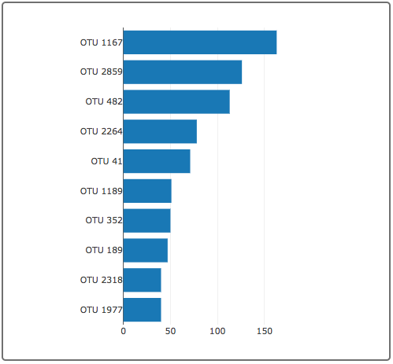
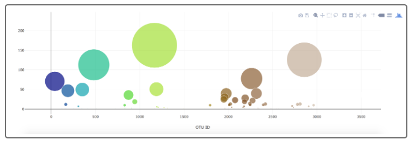
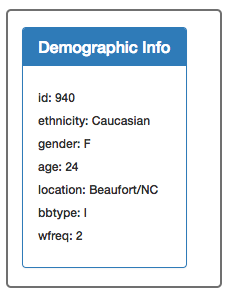
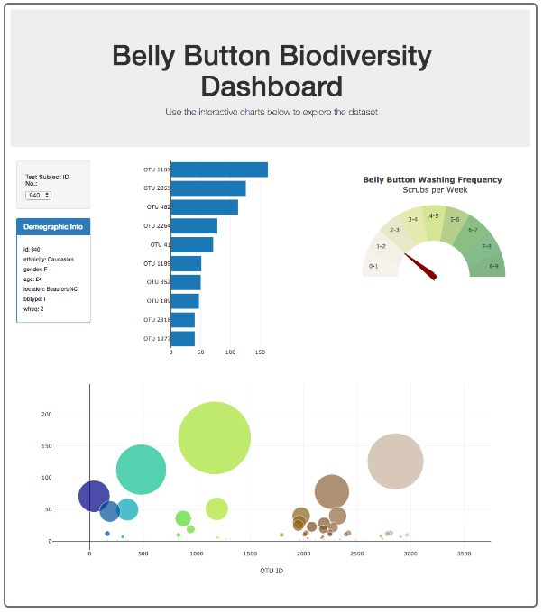

# belly-button-challenge

### The following tasks were completed

1. Used the D3 library to read in 'samples.json' from the URL:
'https://2u-data-curriculum-team.s3.amazonaws.com/dataviz-classroom/v1.1/14-Interactive-Web-Visualizations/02-Homework/samples.json'.

2. Created a horizontal bar chart with a dropdown menu to display the top 10 OTUs found in that individual.

    - Used `sample_values` as the values for the bar chart.

    - Used `otu_ids` as the labels for the bar chart.

    - Used `otu_labels` as the hovertext for the chart.

3. Created a bubble chart that displays each sample.

    - Used `otu_ids` for the x values.

    - Used `sample_values` for the y values.

    - Used `sample_values` for the marker size.

    - Used `otu_ids` for the marker colors.

    - Used `otu_labels` for the text values.

4. Displayed the sample metadata, i.e., an individual's demographic information.

5. Displayed each key-value pair from the metadata JSON object somewhere on the page.

6. Updated all the plots when a new sample is selected. Additionally, you are welcome to create any layout that you would like for your dashboard. An example dashboard is shown as follows:

7. Deployed your app to a free static page hosting service, such as GitHub Pages. Submit the links to your deployment and your GitHub repo. Ensure that your repository has regular commits and a thorough README.md file

